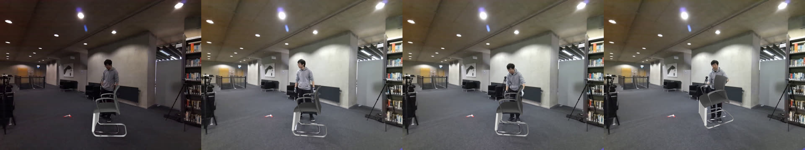
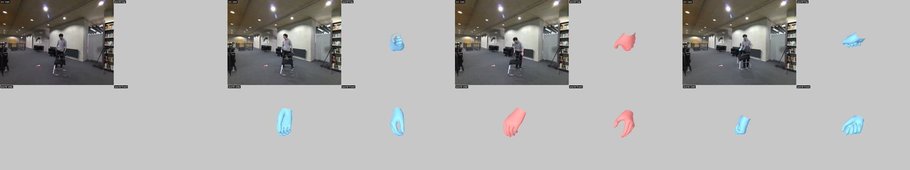
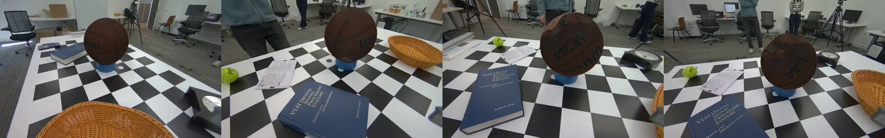

# Reconstruction 在 RTX PRO 6000 Blackwell（sm_120）上的支援

**結論:23 個需要移植的 GPU 映像全部可在 sm_120 建置並派送 CUDA 工作**,包含上游
文件標明此架構不支援的 `v2d_cusfm`。其中 12 個模組已用樣本資料實跑驗證輸出,
**三條主線端到端跑通**:單目物件重建、手部 / ego、立體 HOI 物件重建。實測環境為
RTX PRO 6000 Blackwell（compute capability 12.0）、驅動 581.42。

多視角 `run_mv_hoi_reconstruction` 與 `run_mv_calibration` 仍未實跑,卡在需要
四組立體相機的 rosbag,repo 未附;`v2d_hamer` 卡在 MANO 授權。兩者都是輸入缺口,
不是移植缺口（詳見「未涵蓋」）。

## 改了什麼

| commit | 內容 |
|---|---|
| `build: base images with sm_120 kernels` | 19 個模組 → `pytorch:2.8.0-cuda12.8`,2 個 → `tensorrt:25.09`,2 個 → `cuda:12.8.1`;附帶 `CMAKE_POLICY_VERSION_MINIMUM` |
| `build: add sm_120 to the architecture lists` | `TORCH_CUDA_ARCH_LIST`、`CUDA_ARCH_BIN` 追加 `12.0` |
| `fix: Tensor::type() removals in CUDA extensions` | GroundingDINO、FoundationPose |
| `deps: pins that are keyed to a CUDA older than sm_120` | kaolin、torch、pytorch3d |
| `cusfm: select the CUDA 13 binaries and allow validated architectures` | 改選 cuda13 預編二進位 + 擋板許可機制 |
| `build: check the shipped torch instead of assuming it` | 建置期自檢 |
| `fix: restore the torch.load default the wilor detector needs` | `TORCH_FORCE_NO_WEIGHTS_ONLY_LOAD=1` |
| `build: restore the numpy pin the Dockerfile declares` | bundlesdf、hoi_object_reconstruction |
| `build: cap parallel compile jobs` | 只關於建置主機,可自由丟棄 |

共 25 個檔案:23 個 Dockerfile、`v2d_cusfm/docker/gpu_compatibility.py`、
`v2d_foundation_pose/lib/FoundationPose/bundlesdf/mycuda/common.cu`。

## 為什麼換基底不夠

換 `FROM` 只解決 torch 自己出貨的 kernel。另外三類改動都對應到實際量到的失敗:
- **模組自編的 extension 各自釘死架構。** pytorch3d、nvdiffrast、GroundingDINO 的
  ops、detectron2 都用 `TORCH_CUDA_ARCH_LIST="8.0 8.6 8.9 9.0"` 編譯,基底再新也
  產不出 sm_120 cubin,失敗會延後到第一個 custom op。`v2d_bundlesdf` 還透過
  `CUDA_ARCH_BIN` 把架構傳給一個 vendored CMake 專案,那條路 `TORCH_CUDA_ARCH_LIST`
  管不到。
- **新基底自己會弄壞東西。** 它的 torch 移除了 `Tensor::type()`（GroundingDINO 與
  FoundationPose 都在用）,而且帶的是 CMake 4,拒絕 pybind11 v2.10.0 宣告的
  `cmake_minimum_required(VERSION <3.5)`。
- **有些套件把 CUDA 版本綁在釘選裡。** kaolin 的 wheel 索引依 torch 建置版本分頁;
  `v2d_bundlesdf` 與 `v2d_hoi_object_reconstruction` 自己從 PyPI 裝
  `torch==2.6.0`(cu124 版);pytorch3d 綁死 `py310_cu121_pyt241`,而那是目前唯一
  還在線上的組合,所以改成原始碼編譯。

## 建置全綠不代表能跑:三個實例

這是本次移植最值得記下的一件事。**換基底會在建置成功的映像裡留下第一次執行才會
爆的地雷,而建置日誌完全看不出來。** 三個都是實跑才抓到的:

**1. 相依解析把 torch 換掉。** `v2d_wilor` 建在 cu128 基底上,接著從 git 安裝
WiLoR-mini,其相依解析把 torch 換成 `2.5.0+cu124`（架構清單只到 sm_90）。映像建置
成功,第一次 kernel launch 才死。**修法**:每個映像最後一步自檢 torch 並在必要時
修復;沒裝 torch 的 TensorRT 映像會跳過。

**2. `torch.load` 的預設值變了。** torch 2.6 把 `weights_only` 預設改成 `True`。
WiLoR 的手部偵測器是 ultralytics YOLO pose checkpoint,而 `ultralytics 8.1.34`
呼叫 `torch.load` 時不傳這個參數,於是:

```
UnpicklingError: Weights only load failed
  Unsupported global: GLOBAL ultralytics.nn.tasks.PoseModel
```

**修法**:`ENV TORCH_FORCE_NO_WEIGHTS_ONLY_LOAD=1`。比升級 ultralytics 窄（新版
會帶回自己偏好的 torch）,也比逐一列舉 safe globals 窄（每個 checkpoint 引用到的
類別都要補）。已驗證因果:設了旗標偵測器載入成功並在 `cuda:0` 推論,不設就重現
`UnpicklingError`。

**3. numpy 釘選沒撐過自己的建置。** `v2d_bundlesdf` 與
`v2d_hoi_object_reconstruction` 的 Dockerfile 明確釘 `numpy==1.26.4` 並據此重裝
scipy、scikit-learn、scikit-sparse,但成品映像裡是 numpy 2.2.6 —— 同一份
Dockerfile 後面幾十行的安裝把它推上去了。帶 Cython 型別檢查的 extension 於是全在
import 就爆:

```
ValueError: numpy.dtype size changed, may indicate binary incompatibility.
            Expected 96 from C header, got 88 from PyObject
```

`sksparse.cholmod`、`open3d`、`sklearn` 三個一起掛,整個 BundleSDF 階段做不下去。
**修法**:建置最後把 Dockerfile 自己宣告過的釘選補回去,用 `--no-deps` 免得重蹈
覆轍。修完 numpy 1.26.4 與 torch `2.8.0+cu128`（含 sm_120）同時成立 —— 兩件事本來
不衝突。

稽核過全部 23 個映像,只有這兩個有釘選 numpy,也只有這兩個不符。是否由本次移植
引入未完全確定,但有一條合理路徑:pytorch3d 原本以 `--no-index` 從本地 wheel 安裝
（碰不到 PyPI,動不了任何東西）,改成原始碼建置後就碰得到了。無論如何,釘選是
Dockerfile 自己要求的,補回去不是新意見。

**`kaolin==0.17.0` 的失敗與此移植無關。** 該版本已被上游下架,cu124 與 cu128 兩個
索引頁現在都只發佈 `0.18.0`,所以 `v2d_bundlesdf` 與
`v2d_hoi_object_reconstruction` 照原樣、用原本的基底建也會失敗。

## 驗證範圍

### 建置與派送:23 / 23

**每個模組都問了兩個問題**:torch 編了哪些架構、能不能真的發動一個 kernel。
21 個 torch 映像回報 `2.8.0+cu128`、清單含 `sm_120`、matmul 完成;2 個 TensorRT
映像回報 CUDA 13.0 / TRT 10.13.3。

### 自編 extension 是否真的帶 sm_120 cubin

torch 回報架構清單只證明 torch 自己。所以另外用 `cuobjdump --list-elf` 靜態掃過
23 個映像 `site-packages` 底下所有帶 device code 的 `.so`:

```
帶 sm_120 的 fatbin：104 個
缺 sm_120 的套件  ：open3d 一個（open3d_torch_ops.so、pybind、core_cc）
```
pytorch3d、gsplat、groundingdino、nvdiffrast、flash-attn、warp、torch /
torchvision / torchaudio 全部帶 sm_120,也就是架構清單那兩個 commit 確實生效。

**open3d 這個缺口不構成問題**,兩層理由:它是 PyPI 預編 wheel,V2D 不編譯它,不在
移植範圍;而且 V2D 只用它的 CPU 幾何路徑 —— `v2d_foundation_pose` 就 import
open3d,而它已跑完 100 影格與後續兩條主線。

### 十二個模組實跑,並檢查輸出數值是否合理

| 能力 | 模組 | 結果 |
|---|---|---|
| depth | `v2d_moge` | 100 張深度圖 + 逐格內參 |
| masks | `v2d_sam2` | 人/物兩軌共 200 張遮罩;HOI 線另跑 203 影格 |
| meshes | `v2d_sam3d` | watertight 網格（20.9 萬頂點）+ 6D transform |
| human body | `v2d_sam3d_body` | 100 影格 MHR 參數,2D 關鍵點疊圖確認 |
| 6D pose | `v2d_foundation_pose` | 三條線共四輪追蹤,最長 203 影格 |
| SfM | `v2d_cusfm` | `r2b_galileo` 樣本;HOI 線 303 秒重建出 135 個關鍵影格 |
| stereo depth | `v2d_foundation_stereo` | 單對測試 7.3–50.9 m;HOI 線 203 影格 84 秒 |
| mesh ops | `v2d_mesh` | simplify / transform / align_depth / render 四個進入點 |
| text-prompted detection | `v2d_grounding_dino` | 文字提示 `"basketball"` 命中,信心 0.91 |
| hand pose + MANO | `v2d_wilor` | 100 影格偵測（46 格有手、16 格雙手）+ 完整 MANO 參數 |
| neural reconstruction | `v2d_bundlesdf` | Stage-1 206 秒 + 最終融合 195 秒,產出紋理網格 |
| 流程編排容器 | `v2d_hoi_object_reconstruction` | prepare / mask 後處理 / 階段切分 / 置中 / 世界姿態 / 疊圖 |

### 三條主線端到端

**單目物件重建** `run_video_object_tracking`,九步串五個映像（抽格 → SAM2 →
MoGe → SAM3D → 簡化 → 對齊深度尺度 → 換算實際單位 → FoundationPose → 渲染疊圖）,
每階段各 100 影格齊全。


白色線框是重建網格用估出的姿態投影回原影片的結果,完整片段見
[`assets/sm120_object_mainline.mp4`](assets/sm120_object_mainline.mp4)。疊圖不只
目視:把網格頂點以逐格姿態與內參投影後取 2D 範圍,與同格 SAM2 遮罩比對:

```
100 / 100 影格可比對
IoU   min 0.548   p10 0.585   median 0.604   max 0.711
低於 0.5 的影格:0
```

重點在 **min 0.548 而非 median** —— 沒有任何一格掉下去,表示整段沒有發生追蹤丟失
或跳到別的物體。median 0.60 偏低是這個度量本身的偏差:投影範圍取的是整顆網格的
軸對齊外框（含被遮擋的部分),而遮罩只有可見輪廓,兩者天生不會貼齊。重建網格實際
尺寸 0.69 × 1.02 × 0.74 m,一把椅子該有的樣子 —— 單目影片本身沒有絕對尺度資訊,
這是那兩步換算有效的獨立證據。

**手部 / ego** `run_ego_wilor`,十三步,4 分 46 秒。左右手分軌,產出完整 MANO
參數而非僅關鍵點:

```
mano.betas         list[10]                 形狀
mano.global_orient list[3]                  手腕朝向
mano.hand_pose     list[45]                 15 關節 × 3 軸
cam_t              [0.512, 0.319, 2.359]    公尺
```



SAM2 遮罩覆蓋全部 100 影格,MANO 對齊在 15 與 36 影格上成立再內插補滿;左手累積
路徑 0.949 m、右手 2.228 m。完整片段見
[`assets/sm120_hand_mainline.mp4`](assets/sm120_hand_mainline.mp4)。

一個實務注意:參考影格必須有偵測到的手。預設 `--reference_frame 0` 在這支樣本上
失敗（人物起始位置離鏡頭太遠),換到偵測連續段內的第 87 格才成立。這是素材性質,
不是移植問題。
**立體 HOI 物件重建** `run_reconstruction.py --mode bundlesdf`,repo 自帶的
`basketball_example`（203 對同步立體影格,960×600,基線 14.956 cm),533 秒跑完
全部階段:

```
prepare → CuSFM 303s → 掃描品質檢查 passed → 階段切分 seq_idx 71
→ GroundingDINO 0.91 → FoundationStereo 深度 84s → SAM2 203 影格
→ Stage-1 BundleSDF 207s → FoundationPose 55s → 世界姿態對齊
→ 最終 BundleSDF 195s → FoundationPose 50s → 疊圖
```


**這條線的尺度驗證比另外兩條強,因為有外部已知真值可比。** 7 號籃球直徑
24.0–24.5 cm,而最終融合網格量到:

```
merged_recon/output.glb   0.2330 × 0.2283 × 0.2313 m
```

三軸幾乎等長（最大偏差約 2%,確實是個球),整體 0.231 m,與真實籃球差約 4%。這不是
自我一致性檢查,是拿重建結果對一個外部已知的物理尺寸,所以立體基線推出的公尺尺度
是真的對。
逐格姿態也和拍攝規程一致:物件在相機座標距離 0.362–0.538 m（平均 0.437),軌跡
長度 4.153 m 而淨位移僅 0.085 m —— 繞了一圈回到原點;累積相對旋轉 881°,約兩整圈
加上中途翻面的量。完整片段見
[`assets/sm120_hoi_mainline.mp4`](assets/sm120_hoi_mainline.mp4)。

## 未涵蓋的部分,以及原因

| 範圍 | 狀態 | 卡在哪 |
|---|---|---|
| 多視角主線 `run_mv_hoi_reconstruction`、`run_mv_calibration` | 未實跑 | 需要四組立體相機（前後左右,8 影像 + 8 camera_info topic）的 rosbag,標定另需 6×10 內角、10 cm 方格的棋盤格。repo 未附樣本。屬資料缺口 |
| `v2d_hamer` 與 `--hand_tracking hamer` 分支 | 未實跑 | MANO 資產需個別註冊授權。`prepare_hamer_mano_assets` 明文要求「the licensed MANO asset」 |
| ego 主線的選用分支 | 未實跑 | DROID-SLAM、GeoCalib、AnyCalib、gsplat refinement 的旗標預設關閉,本次未開 |
| 其餘 11 個映像 | 僅建置驗證 | 「可建置 + CUDA 工作能派送 + 自編 extension 帶 sm_120 cubin」三項已確認,但未驗證各自推論輸出正確 |

兩則先前判斷的更正:

- **手部主線不需要 MANO 授權。** `v2d_wilor/lib/download_weights.py` 自己就會抓
  `MANO_RIGHT.pkl`(3.8 MB)、`wilor_final.ckpt`、`detector.pt`。只有 HaMeR 那個
  變體需要另外註冊。先前記為「授權封鎖」是誤判。
- **立體 HOI 主線不需要 rosbag。** repo 附了 `basketball_example`,是 EDEX 之後那
  一層的完整資料集;rosbag 只是前端擷取。先前記為「缺樣本資料」是誤判。真正缺
  rosbag 的只有四相機的多視角主線。

## 套用與注意事項

```bash
git checkout -b sm120-blackwell
git am /path/to/patches/*.patch
cd reconstruction && ./scripts/build_containers.sh
```
- 架構清單是**追加**而非取代,所有模組原本支援的架構都保留。本機實際建置時只編了
  `12.0`（單機自用,每多一個架構就多一份 nvcc 時間);差別僅在產出哪些 cubin,
  sm_120 那份相同。
- `V2D_CUSFM_ALLOWED_SM` 是宣告式許可,不設就維持原本的拒絕行為;它表示「操作者已
  驗證過這個映像」,責任在操作者。HOI 主線的 preflight 讀主機端環境變數,所以要在
  呼叫 `run_reconstruction.py` 之前 export。
- cuSFM 的 CUDA 13 二進位要求驅動 580 以上。
- **TensorRT engine 綁版本。** `v2d_foundation_stereo` 原先隨附的 engine 以 TRT 10.7
  匯出,在新基底的 10.13 上載不起來;實跑前必須先重跑 `run_export_engine`。這不是
  移植缺陷,而是換基底後的必要步驟。
- **權重目錄命名有兩處不一致,與移植無關但會擋住實跑。**
  `v2d_hoi_object_reconstruction` 找的是 `data/weights/foundationstereo` 與
  `data/weights/foundationpose`（皆無底線),而下載包裝與 README 放的是
  `foundation_stereo`、`foundation_pose`。BundleSDF 的 RoMa 權重則解析到
  `data/weights/weights/roma/`,比掛載點深一層。三處都用符號連結接上即可。
- 附帶一個容器化環境的小陷阱:docker 以 `-v` 掛載不存在的主機路徑時會**以 root
  身分建立空目錄**,擋住後續的符號連結。用容器把它刪掉即可,不需要主機 sudo。
- `v2d_sam3d` 與 `v2d_sam3d_body` 的權重在需要個別申請權限的 Hugging Face repo
  （`facebook/sam-3d-objects`、`facebook/sam-3d-body-dinov3`,合計約 17.8 GB）,
  需先同意條款並設好 `HF_TOKEN`。
- 建置耗時差異很大:`v2d_sam3d` 的 flash-attn 編了 1 小時 43 分,
  `v2d_bundlesdf` 66 分鐘,而 `v2d_hoi_object_reconstruction` 只要 8 分鐘——兩者
  Dockerfile 幾乎相同,共用了 Docker 層快取。
